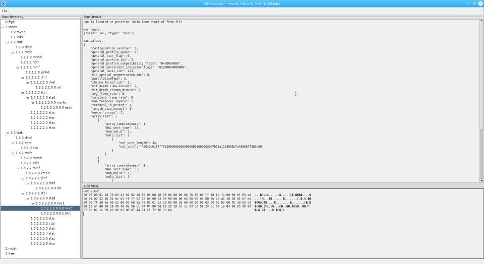

# mp4analyser #
This project is a Python/TkInter application that can read and display the structure and contents of "boxes" 
(AKA "atoms" in Quick Time documentation) within mp4 files that conform to ISO/IEC 14496-12 – MPEG-4 Part 12.

I believe the use of Python allows any technically-minded individual to add their own "box" definitions as required. 
[See wiki](https://github.com/essential61/mp4analyser/wiki)

It should work on any platform that can run a Python interpreter and support TKinter.

# Screenshot #

# Pre-Requisites #
Use the latest version of Python (3.7+). Depending on the Python distribution for your platform, you may also need to install idle3.

# Status #
Very high. A prince among mp4 parsers.

## TODO: ##
* Keep adding boxes.
* Optimise and refine code.

# Authors #
Steven Hentschel

# License #
This project is licensed under the GPL-3.0-or-later

